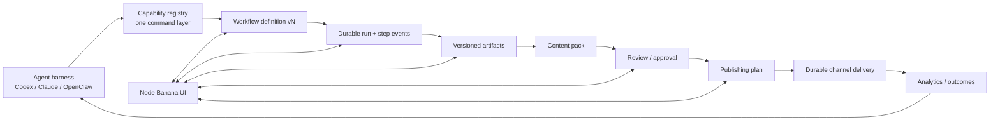

# Agentic reference systems: Postiz, postiz-agent, and agent-media

Date: 2026-07-24

## Research question

What should Node Banana adopt—or deliberately avoid—from Postiz, postiz-agent, and agent-media if the product is to become fully operable by an external agent harness through a CLI, REST, and eventually MCP, with the visual UI adjacent to (rather than required by) execution?

This is a primary-source code review of the three local repositories:

- `/Users/neoak/projects/postiz-app`
- `/Users/neoak/projects/postiz-agent`
- `/Users/neoak/projects/agent-media`

The agent-media repository is a generated public contract rather than its implementation: it states that the private monorepo is the source of truth and that CI mirrors its public skill subtree. Its API, skill, and runtime claims are therefore first-party contract claims, but the underlying implementation could not be inspected here. Source: `/Users/neoak/projects/agent-media/README.md:69-71`.

## Executive synthesis

The most useful product direction is not “put an agent in the app.” It is:

> **Make Node Banana a headless content operating system whose visual canvas is an editor, debugger, approval surface, and run replay—not the place where execution logic lives.**

Three reference patterns support this:

1. **Postiz proves that one backend domain layer can serve the dashboard, public REST API, SDK, and MCP tools.** Its dashboard and public API both call `PostsService`, while its MCP scheduling tool also calls the same validation and creation services. This is the most important architectural pattern to adopt. Sources: `/Users/neoak/projects/postiz-app/apps/backend/src/api/routes/posts.controller.ts:171-223`, `/Users/neoak/projects/postiz-app/apps/backend/src/public-api/routes/v1/public.integrations.controller.ts:186-264`, `/Users/neoak/projects/postiz-app/libraries/nestjs-libraries/src/chat/tools/integration.schedule.post.ts:133-245`.
2. **agent-media proves the value of a small, outcome-oriented agent surface.** One `make_ugc` call hides portrait creation, character reuse, take splitting, video generation, and captions behind a durable run that returns an ID and progress. The agent expresses intent; the server chooses the internal pipeline. Sources: `/Users/neoak/projects/agent-media/skills/make-ugc/SKILL.md:12-40`, `/Users/neoak/projects/agent-media/skills/agent-media-ugc/SKILL.md:20-35`.
3. **postiz-agent proves that a thin CLI can make an existing REST API accessible to shell-based agents, but also shows why a CLI is not itself the domain boundary.** It mainly assembles payloads and calls `/public/v1`; it does not own scheduling logic. Sources: `/Users/neoak/projects/postiz-agent/src/api.ts:17-47`, `/Users/neoak/projects/postiz-agent/src/commands/posts.ts:49-146`.

The recommended architecture is therefore:

- a **versioned JSON workflow definition**;
- a **durable workflow run** with step state, events, artifacts, cost, and approvals;
- a separate **content pack / publishing plan** boundary so retrying generation cannot accidentally republish;
- one transport-agnostic application-command layer;
- generated adapters for REST, CLI, and MCP;
- both coarse outcome tools and lower-level compositional tools;
- idempotency keys on run submission and every irreversible external effect;
- the UI reading and writing the same definitions, runs, drafts, approvals, and publications as an external agent.

This also aligns with Node Banana's existing ADR direction: transport-agnostic tools over persisted drafts (`ADR 0008`), BYO-agent rather than a mandatory hosted agent runtime (`ADR 0009`), review by default with scoped autonomy (`ADR 0010`), and REST-first with MCP as an adapter (`ADR 0011`). Sources: `/Users/neoak/projects/node-banana/docs/adr/0008-social-copilot-persisted-draft-transport-agnostic-tools.md:1-3`, `/Users/neoak/projects/node-banana/docs/adr/0009-agent-native-publishing-byo-agent.md:1-15`, `/Users/neoak/projects/node-banana/docs/adr/0010-external-agent-default-review-opt-in-autonomy.md:1-9`, `/Users/neoak/projects/node-banana/docs/adr/0011-rest-first-agent-interface-bearer-key-mcp-deferred.md:1-12`.

## Comparative view

| System | Agent-facing surface | Workflow abstraction | Durable execution | Strongest lesson | Main caution |
| --- | --- | --- | --- | --- | --- |
| Postiz app | Public REST, SDK, embedded agent, native MCP | Hard-coded LangGraph content pipeline; durable Temporal publishing workflow | PostgreSQL + Temporal + Mastra storage | Reuse backend services across UI, API, and MCP; discover provider schemas before mutation | Public post payload mirrors a complex UI model; creation and MCP scheduling are explicitly non-idempotent |
| postiz-agent | CLI plus installable agent skill | JSON post payload, not a general workflow | Delegates to Postiz | A small CLI can make REST immediately usable by shell agents | Mixed human text and JSON on stdout, `any` schemas, no idempotency/retry contract, duplicated hand-written docs |
| agent-media | REST, CLI, MCP, installable skills/plugin | Outcome-oriented composed skills hiding internal Temporal workflows | Run ID with step progress and artifacts | One intent-level tool, live schema discovery, explicit async run semantics, idempotency header | Public repo does not expose implementation; very coarse tools need lower-level escape hatches for Node Banana's expert audience |

## Most transferable patterns and anti-patterns

| # | Transferable lesson | Type | Why it matters for Node Banana | Primary-source evidence |
| --- | --- | --- | --- | --- |
| 1 | Put domain commands below every transport | Adopt | UI, REST, CLI, and MCP remain behaviorally identical and cannot bypass validation | The Postiz dashboard, public API, and MCP scheduler all call `PostsService`: `/Users/neoak/projects/postiz-app/apps/backend/src/api/routes/posts.controller.ts:171-223`; `/Users/neoak/projects/postiz-app/apps/backend/src/public-api/routes/v1/public.integrations.controller.ts:186-264`; `/Users/neoak/projects/postiz-app/libraries/nestjs-libraries/src/chat/tools/integration.schedule.post.ts:133-245` |
| 2 | Expose common outcomes as one coarse tool, with primitives as an escape hatch | Adopt | A harness can ask for a finished result without reconstructing a fragile graph, while expert users retain control | agent-media routes multiple UGC shapes through `make_ugc` and retains lower-level primitives: `/Users/neoak/projects/agent-media/skills/make-ugc/SKILL.md:12-40`; `/Users/neoak/projects/agent-media/README.md:49-52` |
| 3 | Make long work asynchronous and durable | Adopt | Tool calls do not hang; any harness can poll, reconnect, cancel, or report progress | agent-media returns a `skill_run_id`, current step, step states, artifacts, and final output: `/Users/neoak/projects/agent-media/skills/make-ugc/SKILL.md:68-97` |
| 4 | Discover channel/model requirements from live schemas | Adopt | Provider additions do not require rewriting every agent prompt or CLI manual | Postiz returns provider rules/settings/tools and agent-media declares `tools/list` the live schema: `/Users/neoak/projects/postiz-app/libraries/nestjs-libraries/src/chat/tools/integration.validation.tool.ts:17-110`; `/Users/neoak/projects/agent-media/README.md:40-45` |
| 5 | Require idempotency for intent submission and external effects | Adopt | Agent retries, network timeouts, and harness restarts do not create duplicate runs or posts | agent-media documents `Idempotency-Key`; Postiz's scheduler explicitly admits it is non-idempotent: `/Users/neoak/projects/agent-media/skills/make-ugc/SKILL.md:72-80`; `/Users/neoak/projects/postiz-app/libraries/nestjs-libraries/src/chat/tools/integration.schedule.post.ts:41-48` |
| 6 | Represent approval/OAuth as durable human-action state | Adopt | An agent can pause and hand off instead of pretending to perform a human-only action or holding a chat request open | agent-media explicitly returns an OAuth URL for the human; Postiz's agent instructions require confirmation: `/Users/neoak/projects/agent-media/skills/publish-to-social/SKILL.md:11-23`; `/Users/neoak/projects/postiz-app/libraries/nestjs-libraries/src/chat/load.tools.service.ts:73-87` |
| 7 | Do not make the UI state or UI actions the agent protocol | Avoid | External agents need persisted resources and commands, not React callbacks, selected nodes, or prompt-tag conventions | Postiz exposes component state/actions to Copilot and injects integrations/media into prompt text: `/Users/neoak/projects/postiz-app/apps/frontend/src/components/launches/helpers/pick.platform.component.tsx:137-181`; `/Users/neoak/projects/postiz-app/apps/frontend/src/components/agents/agent.chat.tsx:177-210` |
| 8 | Do not make a public payload mirror a complex editor state tree | Avoid | A stable content pack/publishing plan is easier to validate, version, migrate, and generate than serialized UI internals | Postiz's UI assembles a deep payload and its API page recommends a UI wizard to create it: `/Users/neoak/projects/postiz-app/apps/frontend/src/components/new-launch/manage.modal.tsx:241-417`; `/Users/neoak/projects/postiz-app/apps/frontend/src/components/public-api/public.component.tsx:671-698` |
| 9 | Keep CLI stdout machine-clean and typed | Avoid current Postiz pattern | Harnesses need deterministic JSON, stable errors, and exit codes; decorative prose breaks direct parsing | postiz-agent prints success prose before JSON and uses `any` in public requests: `/Users/neoak/projects/postiz-agent/src/commands/posts.ts:139-146`; `/Users/neoak/projects/postiz-agent/src/api.ts:17-17`; `/Users/neoak/projects/postiz-agent/src/api.ts:42-49` |
| 10 | Separate creative workflow runs from publish commits | Adopt | Retrying generation can never accidentally deliver content; approval and scheduling have independent lifecycles | Postiz uses separate LangGraph generation and Temporal publishing flows: `/Users/neoak/projects/postiz-app/libraries/nestjs-libraries/src/agent/agent.graph.service.ts:378-424`; `/Users/neoak/projects/postiz-app/apps/orchestrator/src/workflows/post-workflows/post.workflow.v1.0.5.ts:52-160` |

## 1. Agent, CLI, MCP, and API surfaces

### Postiz: the backend is already multi-surface

Postiz starts an MCP server inside the Nest backend and obtains the tool set from the same Mastra agent used by its embedded assistant. The server exposes authenticated HTTP MCP endpoints, supports both organization API keys and `pos_` OAuth tokens, and also advertises OAuth authorization metadata with PKCE and `mcp:read` / `mcp:write` scopes. Sources: `/Users/neoak/projects/postiz-app/libraries/nestjs-libraries/src/chat/start.mcp.ts:21-61`, `/Users/neoak/projects/postiz-app/libraries/nestjs-libraries/src/chat/start.mcp.ts:70-130`, `/Users/neoak/projects/postiz-app/libraries/nestjs-libraries/src/chat/start.mcp.ts:133-182`.

Its tools are registered through a tiny `AgentToolInterface`, loaded from Nest dependency injection, then exposed to both the agent and MCP. This is a good transport pattern: the tool is not implemented in the MCP route. Sources: `/Users/neoak/projects/postiz-app/libraries/nestjs-libraries/src/chat/agent.tool.interface.ts:1-8`, `/Users/neoak/projects/postiz-app/libraries/nestjs-libraries/src/chat/load.tools.service.ts:20-48`.

The MCP tool set has a sensible discovery-before-mutation flow:

- list channels;
- retrieve the selected platform's rules, settings schema, character limit, and callable discovery helpers;
- invoke a dynamic provider helper for IDs such as playlists or flairs;
- upload external media;
- schedule the post.

Sources: `/Users/neoak/projects/postiz-app/libraries/nestjs-libraries/src/chat/tools/integration.list.tool.ts:15-45`, `/Users/neoak/projects/postiz-app/libraries/nestjs-libraries/src/chat/tools/integration.validation.tool.ts:17-83`, `/Users/neoak/projects/postiz-app/libraries/nestjs-libraries/src/chat/tools/integration.trigger.tool.ts:24-54`, `/Users/neoak/projects/postiz-app/libraries/nestjs-libraries/src/chat/tools/upload.from.url.tool.ts:33-63`, `/Users/neoak/projects/postiz-app/libraries/nestjs-libraries/src/chat/tools/integration.schedule.post.ts:38-132`.

The tools also provide MCP behavioral annotations such as read-only, destructive, idempotent, and open-world hints. That is useful agent ergonomics and should be copied into Node Banana's MCP adapter. For example, integration listing and schema discovery are marked read-only and idempotent, while scheduling and upload are marked non-idempotent. Sources: `/Users/neoak/projects/postiz-app/libraries/nestjs-libraries/src/chat/tools/integration.list.tool.ts:27-35`, `/Users/neoak/projects/postiz-app/libraries/nestjs-libraries/src/chat/tools/integration.schedule.post.ts:41-48`, `/Users/neoak/projects/postiz-app/libraries/nestjs-libraries/src/chat/tools/upload.from.url.tool.ts:39-46`.

### postiz-agent: CLI as a thin REST adapter

The standalone CLI uses yargs and exposes discovery, post CRUD/status, integration helper calls, media upload, analytics, and authentication. Complex posts can be submitted from a JSON file, while common cases have flags. Sources: `/Users/neoak/projects/postiz-agent/src/index.ts:10-119`, `/Users/neoak/projects/postiz-agent/src/index.ts:120-300`, `/Users/neoak/projects/postiz-agent/src/index.ts:303-394`.

Its implementation is intentionally thin: `PostizAPI` performs direct HTTP requests, and command handlers assemble the backend's post payload. This keeps business logic on the server, which is correct. Sources: `/Users/neoak/projects/postiz-agent/src/api.ts:8-47`, `/Users/neoak/projects/postiz-agent/src/api.ts:141-200`, `/Users/neoak/projects/postiz-agent/src/commands/posts.ts:49-146`.

The installable skill adds agent-specific procedural knowledge: authenticate, discover channels, inspect provider schemas, upload media, post, analyze, and repair missing provider IDs. This is valuable packaging because a tool schema alone does not teach an agent the safest multi-call workflow. Source: `/Users/neoak/projects/postiz-agent/SKILL.md:31-101`.

However, the CLI does not expose MCP itself; the Postiz app does. The plugin only registers the directory as a skill, and its package contains a `postiz` binary. Sources: `/Users/neoak/projects/postiz-agent/.claude-plugin/plugin.json:1-27`, `/Users/neoak/projects/postiz-agent/package.json:1-21`.

### agent-media: one contract, four delivery modes

agent-media deliberately publishes the same capability through a skill installer, Claude plugin, local MCP server, and plain HTTP. The local MCP package receives the same bearer token via environment interpolation. Sources: `/Users/neoak/projects/agent-media/README.md:12-17`, `/Users/neoak/projects/agent-media/.mcp.json:1-16`.

Its strongest contract choice is that MCP `tools/list` and `GET /v1/public/skills` are declared the live schema sources, while prose skills are usage manuals. This prevents the hand-written skill from becoming the authoritative request schema. Source: `/Users/neoak/projects/agent-media/README.md:40-45`.

The public skill files are generated from an internal registry and warn against hand editing. That creates one declared source of truth for runtime schema plus distributed agent guidance. Sources: `/Users/neoak/projects/agent-media/skills/make-ugc/SKILL.md:105-107`, `/Users/neoak/projects/agent-media/skills/make-podcast/SKILL.md:67-69`.

### Recommendation for Node Banana

Build one application-command registry, then generate or wrap it in:

1. REST routes;
2. a CLI with identical request/response JSON;
3. MCP tools with annotations;
4. concise skills that teach multi-call protocols, approval rules, and recovery.

Do not implement behavior separately in CLI handlers, MCP tools, Next.js route handlers, and UI callbacks. A transport should resolve auth context, validate the request, call the same command, and serialize the same result.

## 2. Workflow and content-generation representations

### Postiz has two different workflow concepts

Postiz's content generator is a hard-coded LangGraph. Its typed state contains research, category, topic, hook, format, tone, content, image prompts, image results, and date. The graph wires fixed nodes for web research, categorization, inspiration retrieval, hook/content generation, optional image generation, upload, and time selection. Sources: `/Users/neoak/projects/postiz-app/libraries/nestjs-libraries/src/agent/agent.graph.service.ts:36-55`, `/Users/neoak/projects/postiz-app/libraries/nestjs-libraries/src/agent/agent.graph.service.ts:378-424`.

This graph has useful internal design ideas:

- explicit typed structured outputs for classification, hooks, and content;
- separate generation from media upload;
- a conditional image branch;
- streaming graph events to the caller.

Sources: `/Users/neoak/projects/postiz-app/libraries/nestjs-libraries/src/agent/agent.graph.service.ts:57-103`, `/Users/neoak/projects/postiz-app/libraries/nestjs-libraries/src/agent/agent.graph.service.ts:256-339`, `/Users/neoak/projects/postiz-app/libraries/nestjs-libraries/src/agent/agent.graph.service.ts:366-424`.

But it is not a user-visible, serializable, versioned workflow definition. Nodes, prompts, model names, transitions, and state are compiled in code. That makes it unsuitable as the primary contract for Node Banana's proposed JSON workflows.

Postiz publishing is a separate durable Temporal workflow. It sleeps until `publishDate`, checks current post/channel state, posts the parent and comments, refreshes tokens when needed, emits notifications/webhooks, and processes delayed plugs or repeats. Sources: `/Users/neoak/projects/postiz-app/apps/orchestrator/src/workflows/post-workflows/post.workflow.v1.0.5.ts:52-160`, `/Users/neoak/projects/postiz-app/apps/orchestrator/src/workflows/post-workflows/post.workflow.v1.0.5.ts:163-276`, `/Users/neoak/projects/postiz-app/apps/orchestrator/src/workflows/post-workflows/post.workflow.v1.0.5.ts:278-438`.

The separation is important: content generation and scheduled publishing are different kinds of work with different failure semantics.

### Postiz's post JSON is a delivery document, not a workflow

The `CreatePostDto` represents a delivery request:

- type: draft, schedule, now, or update;
- schedule date and short-link preference;
- one or more platform posts;
- each platform post has an integration, provider-specific settings, and an ordered list of content/comments/thread items;
- each item can have media and delay.

Source: `/Users/neoak/projects/postiz-app/libraries/nestjs-libraries/src/dtos/posts/create.post.dto.ts:25-80`, `/Users/neoak/projects/postiz-app/libraries/nestjs-libraries/src/dtos/posts/create.post.dto.ts:93-124`.

The multi-platform example demonstrates a useful artifact shape: platform-specific copy, media, threads, and settings are all grouped under one campaign request. Source: `/Users/neoak/projects/postiz-agent/examples/multi-platform-with-settings.json:1-95`.

This is closer to what Node Banana should call a **content pack** or **publishing plan**. It should be the output of a content workflow, not the workflow definition itself.

### agent-media presents composed workflows as intent-level tools

`make_ugc` accepts the outcome-defining inputs—script, identity, optional b-roll, captions, and format—then chooses pipeline, take count, and duration internally. A short line, full monologue, and b-roll review are three routes behind the same tool. Sources: `/Users/neoak/projects/agent-media/skills/make-ugc/SKILL.md:12-40`, `/Users/neoak/projects/agent-media/skills/agent-media-ugc/SKILL.md:10-22`.

This is an excellent public abstraction for agents because agents should not be forced to reproduce a fragile internal pipeline. At the same time, agent-media states that lower-level primitives remain available for advanced use. Source: `/Users/neoak/projects/agent-media/README.md:49-52`.

### Recommendation: four separate durable documents

Node Banana should avoid calling every JSON object a workflow. Use four explicit contracts:

1. **Workflow Definition** — reusable, immutable/versioned graph: nodes, edges, input schema, policy, output schema.
2. **Workflow Run** — one execution of a definition: resolved inputs, step attempts, state, events, artifacts, cost, and terminal result.
3. **Content Pack** — generated deliverables: copy variants, assets, provenance, channel adaptations, and quality results.
4. **Publishing Plan** — content-pack references mapped to channel IDs, provider settings, time, review state, and publish policy.

This boundary prevents a generation retry from becoming a publishing retry, lets an agent regenerate one artifact without changing an approved schedule, and gives the UI stable things to inspect.

The public tool layer should support both altitudes:

- outcome tools such as `content.run_recipe`, `campaign.create`, and `publishing.plan`;
- expert tools such as `workflows.validate`, `runs.start`, `runs.get`, `runs.cancel`, `runs.resume`, `artifacts.list`, and `steps.retry`.

## 3. Scheduling and publishing abstractions

### Postiz provider abstraction is broad and centralized

Every social provider implements a common interface for authentication, post creation, optional comments, analytics, provider-specific validation, editor format, scopes, and optional discovery methods. Sources: `/Users/neoak/projects/postiz-app/libraries/nestjs-libraries/src/integrations/social/social.integrations.interface.ts:8-51`, `/Users/neoak/projects/postiz-app/libraries/nestjs-libraries/src/integrations/social/social.integrations.interface.ts:84-128`, `/Users/neoak/projects/postiz-app/libraries/nestjs-libraries/src/integrations/social/social.integrations.interface.ts:138-188`.

The public and MCP surfaces expose provider rules dynamically rather than hard-coding every provider into the agent prompt. This is worth adopting. Sources: `/Users/neoak/projects/postiz-app/libraries/nestjs-libraries/src/chat/tools/integration.validation.tool.ts:84-110`, `/Users/neoak/projects/postiz-app/apps/backend/src/public-api/routes/v1/public.integrations.controller.ts:421-465`.

Post persistence models a thread/comment chain as posts connected by `parentPostId`, while `group` identifies the logical publishing group. It records state, publish date, provider integration, platform release ID/URL, creation method, errors, and repeat interval. Sources: `/Users/neoak/projects/postiz-app/libraries/nestjs-libraries/src/database/prisma/schema.prisma:393-445`, `/Users/neoak/projects/postiz-app/libraries/nestjs-libraries/src/database/prisma/posts/posts.repository.ts:513-585`.

The creation service converts provider settings and media into persisted posts, then starts a Temporal workflow for every non-update request. Source: `/Users/neoak/projects/postiz-app/libraries/nestjs-libraries/src/database/prisma/posts/posts.service.ts:876-933`.

### agent-media chooses a much smaller publishing envelope

agent-media's social publish tool accepts an owned video URL, channel IDs, caption, `now` or `schedule`, and an optional date. It fills platform requirements server-side. This makes it easy for an agent but limits flexibility. Sources: `/Users/neoak/projects/agent-media/skills/publish-to-social/SKILL.md:25-41`.

It also makes two critical state boundaries explicit:

- OAuth connection is a human step; the agent returns the URL but cannot complete authorization.
- `{ success: true }` is not enough; non-empty platform `post_ids` are the evidence of a real post.

Sources: `/Users/neoak/projects/agent-media/skills/publish-to-social/SKILL.md:11-23`, `/Users/neoak/projects/agent-media/skills/publish-to-social/SKILL.md:39-47`.

### Recommendation for Node Banana

Use a provider registry similar to Postiz, but keep the external publishing model simpler:

- `channels.list`
- `channels.get_capabilities`
- `channels.connect` → returns a human-action URL/state
- `publishing.validate(plan)`
- `publishing.create_draft(plan, idempotency_key)`
- `publishing.request_approval(draft_id)`
- `publishing.commit(draft_id, idempotency_key)`
- `publications.get(publication_id)`
- `publications.cancel(publication_id)` when still cancellable

Provider settings should be schema-discoverable and versioned. Prefer typed JSON columns over Postiz's stringified `settings` and `image` fields, which require repeated parse/stringify operations before provider calls. Source: `/Users/neoak/projects/postiz-app/apps/orchestrator/src/activities/post.activity.ts:228-250`.

Treat review and publish as separate commands. Node Banana's current ADRs already correctly choose review by default and explicit per-channel autonomy rather than making the confirmation behavior depend on which UI invoked the tool. Source: `/Users/neoak/projects/node-banana/docs/adr/0010-external-agent-default-review-opt-in-autonomy.md:1-9`.

## 4. API and authentication boundaries

### Useful Postiz patterns

Postiz's public API is isolated under `/public/v1`, with authentication applied as middleware to the public controller. Source: `/Users/neoak/projects/postiz-app/apps/backend/src/public-api/public.api.module.ts:11-35`.

Both public REST and MCP resolve either an OAuth token or an organization API key to an organization context. Sources: `/Users/neoak/projects/postiz-app/apps/backend/src/services/auth/public.auth.middleware.ts:13-58`, `/Users/neoak/projects/postiz-app/libraries/nestjs-libraries/src/chat/start.mcp.ts:26-33`.

postiz-agent's device flow is agent-friendly because it allows a headless terminal to initiate auth and a human to finish it in a browser. It polls for completion, stores credentials with `0700` directory and `0600` file permissions, and falls back to `POSTIZ_API_KEY`. Sources: `/Users/neoak/projects/postiz-agent/src/commands/auth.ts:6-35`, `/Users/neoak/projects/postiz-agent/src/commands/auth.ts:60-157`, `/Users/neoak/projects/postiz-agent/src/config.ts:4-29`.

agent-media similarly uses one bearer token across REST, CLI, and MCP. The server resolves it to a user, and billing belongs to that account. Source: `/Users/neoak/projects/agent-media/reference/auth.md:20-28`.

### Boundaries to avoid copying

Postiz's organization API key path injects a synthetic `SUPERADMIN` membership into the request. This is convenient, but an unscoped organization-wide key is too broad for an agent-native product. Source: `/Users/neoak/projects/postiz-app/apps/backend/src/services/auth/public.auth.middleware.ts:40-57`.

Postiz MCP's `checkAuth` helper populates request context if auth exists but does not itself reject absent auth. The HTTP middleware currently protects the routes, yet the tool-level contract is weaker than its name suggests and could become unsafe under another transport. Source: `/Users/neoak/projects/postiz-app/libraries/nestjs-libraries/src/chat/auth.context.ts:1-15`.

Node Banana should start with:

- hashed bearer agent keys;
- workspace binding;
- explicit action scopes (`workflow:read`, `workflow:run`, `artifact:write`, `draft:write`, `publish:commit`);
- optional channel allow-lists;
- optional spend/run/concurrency limits;
- rotation, revocation, last-used metadata, and audit actor identity;
- a human OAuth handoff for connecting channels;
- authorization enforced inside the application command, not only at the REST/MCP edge.

This is compatible with the current REST-first ADR, but the key record should be designed now for the later MCP adapter. Source: `/Users/neoak/projects/node-banana/docs/adr/0011-rest-first-agent-interface-bearer-key-mcp-deferred.md:1-12`.

## 5. UI/backend coupling

### What Postiz does well

Postiz moved provider validation server-side. The dashboard explicitly calls `/posts/valid`, while the actual `/posts` endpoint re-runs validation and refuses invalid non-drafts. The public API and MCP tool also call the same `validatePosts` service. Sources: `/Users/neoak/projects/postiz-app/apps/frontend/src/components/new-launch/manage.modal.tsx:239-345`, `/Users/neoak/projects/postiz-app/apps/backend/src/api/routes/posts.controller.ts:171-223`, `/Users/neoak/projects/postiz-app/apps/backend/src/public-api/routes/v1/public.integrations.controller.ts:218-264`, `/Users/neoak/projects/postiz-app/libraries/nestjs-libraries/src/chat/tools/integration.schedule.post.ts:148-200`.

That is the correct relationship: the UI can preflight for good feedback, but it is never the authority.

### Where Postiz remains UI-shaped

The dashboard builds a deeply nested post payload from editor refs, selected integrations, global/internal content arrays, local media structures, settings, tags, dates, and short-link dialog state. Source: `/Users/neoak/projects/postiz-app/apps/frontend/src/components/new-launch/manage.modal.tsx:241-417`.

Postiz's own Public API UI admits that building the POST payload is complex and offers a wizard that creates a post in the UI so the caller can copy the generated payload. Source: `/Users/neoak/projects/postiz-app/apps/frontend/src/components/public-api/public.component.tsx:671-698`.

The older embedded Copilot pattern is more tightly coupled: components expose `useCopilotReadable` state and `useCopilotAction` callbacks that mutate selected UI integrations. Sources: `/Users/neoak/projects/postiz-app/apps/frontend/src/components/launches/helpers/pick.platform.component.tsx:137-181`, `/Users/neoak/projects/postiz-app/apps/frontend/src/components/new-launch/editor.tsx:198-220`.

The dedicated agent UI also appends media and selected integrations as tagged text inside the user's message. That works for the UI, but makes UI prompt formatting part of the application protocol. Source: `/Users/neoak/projects/postiz-app/apps/frontend/src/components/agents/agent.chat.tsx:177-210`.

### Recommendation for Node Banana

The UI should never be the execution target of an external agent. It should:

- edit workflow definitions through domain commands;
- start runs through the same run command as CLI/MCP;
- subscribe to run events;
- render artifacts and step state;
- collect approval and resume a blocked run;
- compare/replay/fork runs;
- inspect publication outcomes.

Avoid tools such as “select this canvas node,” “open this modal,” or “apply these editor operations” as the canonical agent API. UI-only convenience actions may exist, but every meaningful outcome must have a persisted, UI-independent command.

## 6. Persistence, idempotency, and execution safety

### Strong reference patterns

Postiz uses deterministic Temporal workflow IDs (`post_<postId>`) and search attributes for post and organization IDs. A recovery activity uses `signalWithStart` plus `USE_EXISTING` to poke missing jobs without creating a second workflow. Sources: `/Users/neoak/projects/postiz-app/libraries/nestjs-libraries/src/database/prisma/posts/posts.service.ts:694-750`, `/Users/neoak/projects/postiz-app/apps/orchestrator/src/activities/post.activity.ts:68-105`.

Its persisted post state (`QUEUE`, `PUBLISHED`, `ERROR`, `DRAFT`) and release IDs/URLs allow the UI and API to inspect publication state independently of the worker process. Source: `/Users/neoak/projects/postiz-app/libraries/nestjs-libraries/src/database/prisma/schema.prisma:393-445`, `/Users/neoak/projects/postiz-app/libraries/nestjs-libraries/src/database/prisma/schema.prisma:903-908`.

agent-media requires an `Idempotency-Key` for REST skill submission and returns a durable `skill_run_id` for polling. Sources: `/Users/neoak/projects/agent-media/skills/make-ugc/SKILL.md:68-80`, `/Users/neoak/projects/agent-media/skills/make-podcast/SKILL.md:22-45`.

### Gaps and risks

Postiz's scheduling MCP tool truthfully marks itself non-idempotent, and each call generates new groups/item IDs before creating posts. A retried agent call can therefore create duplicates. Sources: `/Users/neoak/projects/postiz-app/libraries/nestjs-libraries/src/chat/tools/integration.schedule.post.ts:41-48`, `/Users/neoak/projects/postiz-app/libraries/nestjs-libraries/src/chat/tools/integration.schedule.post.ts:203-240`.

The REST/CLI create request has no client idempotency key. The CLI sends the request once, while its API wrapper has no timeout or retry classification. Sources: `/Users/neoak/projects/postiz-agent/src/api.ts:17-47`, `/Users/neoak/projects/postiz-agent/src/commands/posts.ts:139-146`.

The Temporal publishing workflow retries activities three times, while `postSocial` performs the external provider post before the database is updated with its returned release ID. If the provider accepts a request but the activity result is lost, retry safety depends on each provider's behavior; no generic provider idempotency key appears in the common interface. This is an inference from the retry and provider-call boundaries, not proof that duplicates occur. Sources: `/Users/neoak/projects/postiz-app/apps/orchestrator/src/workflows/post-workflows/post.workflow.v1.0.5.ts:19-46`, `/Users/neoak/projects/postiz-app/apps/orchestrator/src/activities/post.activity.ts:207-251`, `/Users/neoak/projects/postiz-app/libraries/nestjs-libraries/src/integrations/social/social.integrations.interface.ts:84-115`.

### Recommendation for Node Banana

Use idempotency at two levels:

1. **Command idempotency** — every run creation, draft creation, schedule creation, and publish commit accepts an `idempotency_key` scoped to actor + operation. Persist request hash and response. Reusing a key with different input is an error.
2. **Effect idempotency** — each external step has a stable effect key derived from `run_id + step_id + logical_effect`. Persist `intent → submitted → acknowledged/reconciled` with provider request and response references.

Do not treat a workflow engine's retry as proof of exactly-once external effects. On an ambiguous timeout, transition to `reconciling` or `needs_attention`; do not blindly publish again.

Workflow definition versions should be immutable once run. A run must retain the exact definition version, resolved node versions, inputs, secret references (not secret values), model/provider choices, and policy snapshot that produced its artifacts.

## 7. Observability and long-running ergonomics

Postiz stores Mastra messages, threads, workflow snapshots, AI spans, and traces in PostgreSQL, and uses Temporal search attributes for operational lookup. Sources: `/Users/neoak/projects/postiz-app/libraries/nestjs-libraries/src/database/prisma/schema.prisma:688-716`, `/Users/neoak/projects/postiz-app/libraries/nestjs-libraries/src/database/prisma/schema.prisma:739-842`.

It also records post errors and creation method and emits Sentry counters for public API calls and post creation. Sources: `/Users/neoak/projects/postiz-app/libraries/nestjs-libraries/src/database/prisma/schema.prisma:393-445`, `/Users/neoak/projects/postiz-app/apps/backend/src/public-api/routes/v1/public.integrations.controller.ts:80-105`, `/Users/neoak/projects/postiz-app/libraries/nestjs-libraries/src/database/prisma/posts/posts.service.ts:917-930`.

agent-media exposes a more agent-friendly progress contract: run status, `current_step`, per-step status, intermediate artifact URLs, final output, and `workflow_id` for support. Its skill explicitly instructs the agent to report progress when the current step changes. Sources: `/Users/neoak/projects/agent-media/skills/make-ugc/SKILL.md:88-97`, `/Users/neoak/projects/agent-media/skills/make-podcast/SKILL.md:53-60`, `/Users/neoak/projects/agent-media/skills/agent-media-ugc/SKILL.md:56-61`.

Node Banana should expose:

- `run_id`, `definition_id`, and `definition_version`;
- overall state: queued, running, waiting_for_approval, retrying, reconciling, succeeded, failed, cancelled;
- current step plus attempt;
- append-only sequenced events;
- step inputs/outputs with redaction;
- artifact IDs, previews, checksums, provenance, and lineage;
- provider/model, duration, token/credit/currency cost;
- retry schedule and structured error code;
- publication IDs and provider references;
- links the UI can open directly to the run/step/artifact.

Offer polling for the first implementation, then SSE/webhooks for efficient harness integration. The important part is that the polling object is stable, structured, and resumable.

## 8. Tool and CLI ergonomics

### Adopt

- Dynamic schema discovery before provider-specific work, as in Postiz's integration schema and agent-media's `tools/list`. Sources: `/Users/neoak/projects/postiz-app/libraries/nestjs-libraries/src/chat/tools/integration.validation.tool.ts:17-83`, `/Users/neoak/projects/agent-media/README.md:40-45`.
- Outcome-oriented tools for common user intents, as in `make_ugc`. Source: `/Users/neoak/projects/agent-media/skills/make-ugc/SKILL.md:12-40`.
- Explicit asynchronous submission and run polling rather than keeping a tool call open for 6–23 minutes. Source: `/Users/neoak/projects/agent-media/skills/make-ugc/SKILL.md:82-97`.
- Machine-meaningful MCP annotations. Source: `/Users/neoak/projects/postiz-app/libraries/nestjs-libraries/src/chat/tools/integration.schedule.post.ts:41-48`.
- Skills that teach human boundaries and recovery, not duplicate the canonical schema. Sources: `/Users/neoak/projects/agent-media/skills/publish-to-social/SKILL.md:11-23`, `/Users/neoak/projects/agent-media/skills/make-ugc/SKILL.md:68-77`.
- Media ingestion as a first-class command with server-side type, size, domain, and SSRF checks. Source: `/Users/neoak/projects/postiz-app/libraries/nestjs-libraries/src/chat/tools/upload.from.url.tool.ts:64-140`.

### Avoid

- **Mixed human and machine output.** postiz-agent documentation says every command outputs JSON, but command handlers print an emoji status line before JSON. That makes stdout awkward for agents and `jq`. Sources: `/Users/neoak/projects/postiz-agent/README.md:453-453`, `/Users/neoak/projects/postiz-agent/src/commands/posts.ts:139-146`, `/Users/neoak/projects/postiz-agent/src/commands/integrations.ts:4-16`.
- **`any` as the public SDK type.** The CLI request wrapper and command payloads are largely untyped even though the backend has DTOs. Sources: `/Users/neoak/projects/postiz-agent/src/api.ts:17-17`, `/Users/neoak/projects/postiz-agent/src/api.ts:42-49`, `/Users/neoak/projects/postiz-agent/src/commands/posts.ts:49-54`.
- **Process exit inside reusable command functions.** This makes the CLI handlers difficult to reuse as a library or test in-process. Source: `/Users/neoak/projects/postiz-agent/src/commands/posts.ts:56-79`, `/Users/neoak/projects/postiz-agent/src/commands/posts.ts:139-147`.
- **A payload so UI-shaped that callers need a wizard to generate it.** Source: `/Users/neoak/projects/postiz-app/apps/frontend/src/components/public-api/public.component.tsx:671-698`.
- **Instructions that tell an agent to retry a non-idempotent scheduling tool merely by correcting parameters without a dedupe key.** Source: `/Users/neoak/projects/postiz-app/libraries/nestjs-libraries/src/chat/tools/integration.schedule.post.ts:50-63`.

Recommended CLI conventions:

- stdout contains exactly one JSON result by default for non-interactive commands;
- progress and diagnostics go to stderr;
- stable exit codes and error objects (`code`, `message`, `retryable`, `details`);
- `--output json|jsonl|table`, with JSON the agent default;
- `--wait` and `--no-wait` for async commands;
- `runs watch <id>` streams JSONL events;
- all mutations accept `--idempotency-key`;
- `--dry-run` performs full resolution/validation without external effects;
- no interactive prompts unless `--interactive` is supplied; return `human_action_required` otherwise.

## 9. Product direction for Node Banana's niche

Node Banana should not compete with Postiz as “another social scheduler” or with agent-media as “one hosted media generator.” Its defensible niche can be:

> **A bring-your-own-agent creative production and launch system: reusable visual workflow definitions, reproducible asset lineage, approval, scheduling, and run replay—operable headlessly from any harness.**

Postiz's center is connected channels and calendar delivery. agent-media's center is a finished generated artifact. Node Banana can own the seam between them:

- an agent chooses or composes a content recipe;
- Node Banana executes a versioned creative DAG;
- every intermediate result becomes a named artifact;
- the human can visually inspect, edit, fork, or approve in the current UI;
- the agent turns approved artifacts into a channel-specific content pack;
- a separate publishing plan schedules it;
- analytics feeds a later run without erasing provenance.

This makes the UI valuable without making it a runtime dependency. It also fits the existing “cockpit” decision in `ADR 0012`, while expanding the cockpit from a passive interface into a shared control plane over headless runs. Source: `/Users/neoak/projects/node-banana/docs/adr/0012-node-banana-cockpit-flowleap-engine.md:1-9`.

## 10. Proposed minimum agent contract

The smallest useful dogfood surface is:

### Discovery

- `system.capabilities`
- `workflows.list`
- `workflows.get`
- `workflows.validate`
- `channels.list`
- `channels.get_capabilities`

### Execution

- `runs.start({ workflow, inputs, policy }, idempotency_key)`
- `runs.get(run_id)`
- `runs.events(run_id, after_sequence)`
- `runs.cancel(run_id)`
- `runs.resume(run_id, approval_or_input)`
- `artifacts.list(run_id)`
- `artifacts.get(artifact_id)`

### Content and publishing

- `content_packs.create_from_run(run_id, output_mapping)`
- `publishing.validate(content_pack_id, targets)`
- `publishing.create_draft(...)`
- `publishing.commit(draft_id, idempotency_key)`
- `publications.get(publication_id)`

The CLI mirrors these nouns:

```text
banana workflows validate workflow.json
banana runs start workflow.json --inputs inputs.json --idempotency-key ...
banana runs get run_...
banana runs watch run_...
banana artifacts list --run run_...
banana publish validate plan.json
banana publish commit draft_... --idempotency-key ...
```

MCP can initially expose fewer, more intent-level tools:

```text
list_workflows
run_workflow
get_run
list_run_artifacts
create_content_pack
create_publish_draft
commit_publish_draft
```

The agent should not need the UI for any of these. The UI should be able to open every returned ID.

## 11. Concrete design rules

1. **Persist intent before work.** Return an ID before starting long-running work.
2. **Version definitions, schemas, nodes, and content packs.**
3. **Separate generation, approval, and publish commits.**
4. **Make all external mutations idempotent or explicitly reconcilable.**
5. **Make provider requirements discoverable, not prompt-only.**
6. **Keep auth in the command layer as well as the transport edge.**
7. **Represent human action as durable state, not a hanging chat request.**
8. **Expose progress as structured events and artifacts.**
9. **Keep stdout machine-clean and errors stable.**
10. **Generate REST/CLI/MCP schemas and skill references from one registry.**
11. **Offer one-call recipes for common outcomes and primitives for experts.**
12. **Let the UI edit and observe the same resources agents use.**

## 12. Questions to resolve in product discovery

These are product decisions rather than questions the references can answer:

- Is the first niche a solo content operator, an AI-native agency, a media team, or developers building content agents?
- Is Node Banana expected to execute model calls, or primarily orchestrate calls made by a user's local harness?
- Are workflow definitions portable files, workspace database objects, Git-tracked artifacts, or all three with one canonical form?
- Which steps must be resumable after process/server restart in the first dogfood release?
- What is the smallest useful content pack: one asset, a multi-platform campaign, or a full calendar?
- Is approval attached to a workflow step, artifact, content pack, publishing draft, or a combination?
- Which actions may an agent key perform without review, and should limits be per channel, workflow, budget, or time window?
- Will a user want to edit a running definition, or always fork a new immutable version?
- What is the first analytics feedback signal worth exposing to agents?

The architectural work should begin only after choosing the first end-to-end “golden path.” A strong candidate is:

> External agent selects a saved JSON recipe → starts a run → watches structured progress → receives image/video/text artifacts → creates a persisted content pack → human reviews it in Node Banana → agent or human schedules it → both can inspect publication state.

## 13. Node Banana readiness and gaps

Node Banana is closer to this architecture than the older vision notes imply, but the two halves are at very different levels of readiness.

### What is already strong

- **Social publishing is substantially headless.** Draft, media, validation, scheduling, and publish functions receive an explicit workspace/user context and operate on persisted records. The current agent registry can already expose these functions without a React component or browser session. Sources: `/Users/neoak/projects/node-banana/src/lib/agent-tools/registry.ts:1-20`, `/Users/neoak/projects/node-banana/src/lib/agent-tools/registry.ts:63-229`.
- **Publishing is durable.** The existing Vercel Workflow implementation persists the publish lifecycle across sleeps and retries, reloads state before the external effect, and separates provider publishing into steps. Source: `/Users/neoak/projects/node-banana/workflows/social-publish.ts:19-139`.
- **Projects already persist workflow JSON and assets are first-class database records.** These are useful migration points, although a mutable `workflowJson` blob is not yet a versioned workflow/run model. Sources: `/Users/neoak/projects/node-banana/src/lib/db/schema.ts:318-370`, `/Users/neoak/projects/node-banana/src/lib/studio/repository.ts:436-500`.
- **A CLI and stdio MCP proof now exist.** Both consume the same `AGENT_TOOL_DEFS` registry and the CLI keeps tool-call results as JSON. Sources: `/Users/neoak/projects/node-banana/scripts/node-banana-cli.ts:1-23`, `/Users/neoak/projects/node-banana/scripts/node-banana-cli.ts:60-125`, `/Users/neoak/projects/node-banana/scripts/node-banana-mcp.ts:25-87`.

The proof is healthy enough to continue: `pnpm typecheck` passes; 131 targeted Social Copilot and workflow-store tests pass; and `pnpm node-banana tools` successfully emits the 14 current social tool schemas.

### The structural blockers

1. **Creative workflow execution still lives in the UI store.** `workflowStore.ts` imports Zustand, React Flow, toast UI, local-storage helpers, studio browser clients, and execution functions into one 2,400-line module. Its persisted `WorkflowFile` mixes semantic nodes and edges with visual layout, edge style, and groups. Sources: `/Users/neoak/projects/node-banana/src/store/workflowStore.ts:1-94`, `/Users/neoak/projects/node-banana/src/store/workflowStore.ts:192-202`.
2. **Several node executors assume a browser or same-origin HTTP.** They call relative `/api/*` URLs, and video processing creates DOM video/canvas elements. A Node process or durable worker cannot execute the full current graph unchanged. Sources: `/Users/neoak/projects/node-banana/src/store/execution/nanoBananaExecutor.ts:134-224`, `/Users/neoak/projects/node-banana/src/store/execution/llmGenerateExecutor.ts:72-72`, `/Users/neoak/projects/node-banana/src/store/execution/videoProcessingExecutors.ts:266-270`, `/Users/neoak/projects/node-banana/src/store/execution/videoProcessingExecutors.ts:372-403`.
3. **Simple Studio is a second client-side runtime.** It separately orchestrates copy/image/video generation through browser fetches and stores transient run state in Zustand. This would become a second source of behavior unless it is reduced to a client of the same generation/run commands. Sources: `/Users/neoak/projects/node-banana/src/store/simpleStudioStore.ts:263-326`, `/Users/neoak/projects/node-banana/src/store/simpleStudioStore.ts:337-488`.
4. **Creative definitions exist, but creative runs do not.** The database stores the latest workflow JSON on `projects`; there is no persisted definition-version, creative-run, step-run, or run-event resource comparable to the durable social publish state. Source: `/Users/neoak/projects/node-banana/src/lib/db/schema.ts:318-351`.
5. **Generation is still route-shaped rather than service-shaped.** The route owns request parsing, workspace-header asset resolution, provider selection, API-key lookup, error mapping, and response serialization. Extracting a `GenerationService` is the prerequisite for both server-side workflow execution and direct generation tools. Sources: `/Users/neoak/projects/node-banana/src/app/api/generate/route.ts:13-27`, `/Users/neoak/projects/node-banana/src/app/api/generate/route.ts:87-206`.
6. **The canonical registry is not yet fully canonical.** Social Copilot and `AGENT_TOOL_DEFS` duplicate tool names, descriptions, and Zod input schemas while calling the same service functions. They can drift even though the domain behavior is shared. Sources: `/Users/neoak/projects/node-banana/src/lib/social/copilot/tools/index.ts:39-202`, `/Users/neoak/projects/node-banana/src/lib/agent-tools/registry.ts:44-229`.
7. **Approval is advertised, not universally enforced.** The in-app AI SDK tools use `needsApproval`, but the current CLI and MCP adapters call the same commit functions directly. MCP maps `requiresApproval` to `destructiveHint` and then executes the tool when called; a client that ignores hints can publish. Server-side key scope, policy, idempotency, and approval state must be authoritative. Sources: `/Users/neoak/projects/node-banana/src/lib/social/copilot/tools/index.ts:181-200`, `/Users/neoak/projects/node-banana/scripts/node-banana-mcp.ts:34-60`, `/Users/neoak/projects/node-banana/scripts/node-banana-cli.ts:110-116`.
8. **The current headless identity is a trusted local-admin context.** A caller can select workspace/user through flags or environment variables and then use direct database services. That is useful for local dogfooding, but it is not a remote multi-tenant agent-key boundary. Source: `/Users/neoak/projects/node-banana/src/lib/agent-tools/context.ts:14-48`.
9. **The social automation JSON is not a general scheduling workflow.** It currently supports schedule/manual/event triggers and one `create_social_post` action, with useful loop and chain guards. Keep those safety ideas, but model future triggers as invocations of versioned workflow definitions rather than widening `actionConfig` into an untyped mini-language. Source: `/Users/neoak/projects/node-banana/src/lib/social/automation-guards.ts:3-11`, `/Users/neoak/projects/node-banana/src/lib/social/automation-guards.ts:149-243`.

## 14. Recommended product boundary

The newest product framing should supersede one part of the earlier ADR language:

> **The external harness is the planner; Node Banana is the headless content runtime and control plane; the UI is the cockpit.**

This keeps the good BYO-agent cost boundary—Node Banana does not host an open-ended autonomous “brain”—while allowing the harness to invoke reliable multi-step creative recipes, wait for durable runs, and use the resulting artifacts. It is broader than ADR 0009's “destination, not runtime” and ADR 0012's “flowleap is the engine.” Those ADRs should eventually be amended rather than left in contradiction with the new product.

The two JSON systems should stay distinct:

| Contract | Semantics | Examples |
| --- | --- | --- |
| `content-workflow/v1` | Typed creative DAG executed now | research → copy → image/video → quality gate → content pack |
| `automation/v1` | Trigger/policy that starts a workflow later | cron/event/calendar trigger → workflow version + inputs + limits |

They share the same run, artifact, approval, event, and identity infrastructure. A publishing plan remains a separate delivery resource so a creative retry cannot republish.



The likely niche is narrower than “social media management”:

> **Technical founders and AI-native creative operators who already live in an agent harness and want reproducible multimodal content production plus launch—not another chat box or calendar.**

Postiz owns the calendar/channel center. agent-media owns one finished-video outcome. Node Banana can own content-as-code: portable recipes, visual inspection, asset lineage, run replay, approval, and multi-channel launch.

## 15. Recommended first golden slice

Do not begin by adding dozens of tools. Prove one complete loop:

> A Codex agent in this repository validates a saved JSON recipe, starts it, polls a persisted run, obtains text plus one image asset, creates a LinkedIn draft, and stops at human approval.

The first implementation sequence should be:

1. Extract `GenerationService` and one server-safe text/image node executor from Next/React boundaries.
2. Define strict `content-workflow/v1` and output schemas; place visual layout under an optional `ui` field so the semantic contract is headless.
3. Add immutable workflow versions plus `workflow_runs`, `step_runs`, and append-only `run_events`.
4. Implement `workflows.validate`, `runs.start`, `runs.get`, `runs.events`, `runs.cancel`, and `artifacts.list`.
5. Add command idempotency and a persisted approval state before any publish commit is reachable.
6. Expose the commands through REST first; make CLI and MCP thin clients of that remote boundary, while retaining a local direct mode only as an explicit development/admin mode.
7. Change the visual canvas and Simple Studio to call the same run commands.
8. Dogfood from Codex, then add video, conditional/router nodes, automation triggers, analytics, and public packaging.

The current CLI `call <tool> --input JSON` is a useful universal escape hatch. Add noun commands for reliable agent ergonomics (`banana runs start`, `banana runs get`, `banana runs watch`) rather than deleting the generic form.

## 16. Codex-facing packaging

For local development, a project-scoped stdio MCP server is sufficient. For installed or hosted use, expose Streamable HTTP MCP with bearer/OAuth authentication; current Codex clients support both transports and share MCP configuration across the desktop app, CLI, and IDE extension. Put cross-tool sequencing, approval rules, and rate limits in the MCP server's `instructions`, and keep a bundled skill focused on the golden workflows and recovery behavior. [Official Codex MCP guidance](https://learn.chatgpt.com/docs/extend/mcp).

For distribution, package the skill and MCP-backed app as a plugin after the contract is stable. OpenAI's current guidance is MCP-first: define tools and their input/output schemas, add accurate read-only/destructive/open-world annotations, then add UI only where inspection, editing, comparison, or confirmation benefits from it. Tools must remain useful without the UI. [Official Apps SDK tool-planning guidance](https://developers.openai.com/apps-sdk/plan/tools), [official MCP server guidance](https://developers.openai.com/apps-sdk/build/mcp-server), and [official UI separation guidance](https://developers.openai.com/apps-sdk/build/chatgpt-ui).

For immediate dogfooding in this repo:

- keep operational product instructions in an installable skill, not in `AGENTS.md`;
- keep repo build/test conventions in `AGENTS.md`;
- point project `.codex/config.toml` at the local MCP server only after the server has stable tools and safety policy;
- give every returned run, artifact, draft, and publication a UI deep link so Codex can hand the human directly to the right review surface.
